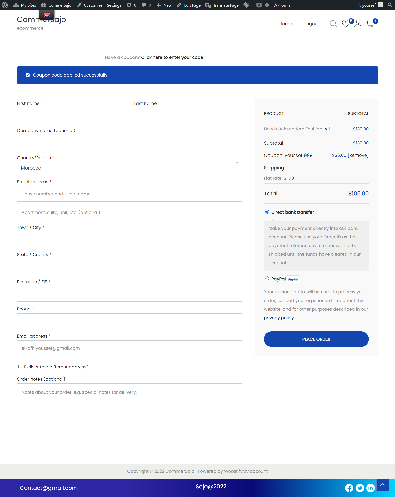

# Site E-commerce

## site E-commerce avec WordPress et le plugin -WooCommerce

## Fonctionnalités

- Creer par utilisation le plugin WooCommerce
- Plusieur catégories et des produits(titre, image, prix)
- Contient des coupon de réduction
- Contient des différent comptes utilisateurs 'clients' et 'administrateurs'
-  Contient les  plugins pour le marketing SEO

## Plugins

Dillinger is currently extended with the following plugins.
Instructions on how to use them in your own application are linked below.

| Plugin | 
| ------ | 
| [Woocommerce](https://woocommerce.com/) 
|[ WooCommerce PayPal Checkout Gateway](https://wordpress.org/plugins/woocommerce-gateway-paypal-express-checkout)|
|[Variation Swatches for WooCommerce](https://wordpress.org/plugins/woo-variation-swatches/) | 
| [ WooCommerce PayPal Checkout Gateway](https://wordpress.org/plugins/woocommerce-gateway-paypal-express-checkout) |
| [TI WooCommerce Wishlist](https://wordpress.org/plugins/ti-woocommerce-wishlist/) |

## Captures écran des pages

### login page
## -----------------------------------------------------

### Register page

### Home page

### Show product page

### Basket page

### Wishlist page

### Shop page

### Payment page

